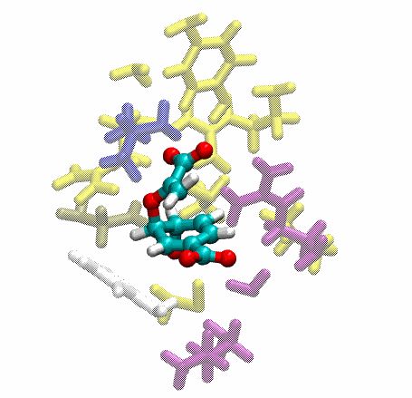

# QM/MM Modelling of Enzyme Reactions modified by th2ch-g

### Let's see enzyme reaction 


### Run
1. cd work
```
cd work
```

2. prepare initial structure using tleap
```
tleap -f script/tleap.in
```

3. run md simulation (classical)
```
./cmd_md.sh
```

4. run qmmm simulation (QM level)
```
./cmd_qmmm.sh
```

5. run qmmm simulation with Steered MD (QM level)
```
./cmd_qmmm_pull.sh
```

### View the result
```
vmd cm.parm7 npt_qmmm_pull_1.nc -e visu_reaction.vmd
```

- You will see enzyme reaction


